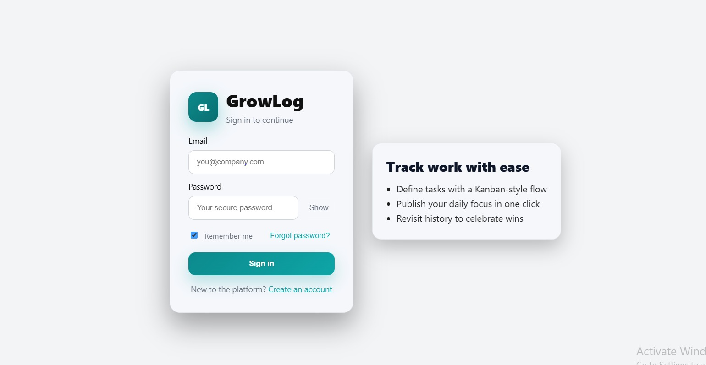

# GrowLog - Task Management System

<p align="center">
  
  
  
  
</p>

GrowLog is a powerful and intuitive web application designed to help organizations streamline their workflow by efficiently tracking tasks, deadlines, and progress. This tool enhances team collaboration and productivity by providing a centralized platform for all task management needs.

---
### 🏗️ Architectural Diagram


## ✨ Features
- **Task Creation & Assignment:** Easily create new tasks and assign them to team members.  
- **Status Tracking:** Monitor the progress of tasks with customizable statuses (e.g., To-Do, In Progress, Done).  
  
- **High Availability:** The backend is load-balanced across two server instances to ensure reliability and uptime.  

---

## 🛠️ Tech Stack
- **Frontend:** ReactJS  
- **Backend:** Node.js, Express.js  
- **Load Balancer:** Nginx  
- **Package Manager:** npm, jsonwebtoken , passportjs 

---

## 📋 Prerequisites
Before you begin, ensure you have the following installed:

- Node.js (v18.0.0 or higher)  
- npm (v9.0.0 or higher)  
- Nginx  

---

## 🚀 Getting Started
To get a local copy up and running, follow these simple steps.  
This setup requires running **four separate processes** in different terminal windows.

### 1. Clone the Repository
```bash
git clone https://github.com/Eshani-R-Sawant/GrowLog--Workflow-Enhancement-system
```

### 2. Environment Variables
- Navigate to the Backend directory:
```
cd Backend
```
- Create a new file named .env and add the following:
```
PORT=7001
```
- We need to follow the same steps for another backend folder
but set the 
```
PORT=7002
```

### 3. Running the Application
- Open four separate terminal windows/tabs and run:
##### 🖥️ Terminal 1: Start Backend Server 1
```
cd Backend
npm install
npm run dev
```
- Server runs on port 7001.
##### 🖥️ Terminal 2: Start Backend Server 2
```
cd Backend_copy
npm install
npm run dev
```
- Server runs on port 7002.
##### 🖥️ Terminal 3: Start Nginx Load Balancer
```
cd nginx/nginx-1.29.1/
./nginx.exe -c conf/load-balancer.conf
```
- This starts Nginx as a reverse proxy/load balancer, forwarding requests to ports 7001 or 7002.
##### 🖥️ Terminal 4: Start Frontend Server
```
cd Frontend
npm install
npm run dev
```

### 4. Access the Application
- Once all servers are running, open:
```
http://localhost:5173
```

---
## 📁 Project Structure
```
GrowLog/
├── Backend/              # Primary backend server (port 7001)
├── Backend_copy/         # Secondary backend server (port 7002)
├── Frontend/             # Frontend application (port 5173) 
├── nginx/                # Nginx configuration files
│   └── nginx-1.29.1/
│       └── conf/
│           └── load-balancer.conf
└── README.md
```

## 📸 Screenshots
- Login page 
    
- Sign Up page
    
- Dashboard page
    
- History page
    
- Team page
    
- Profile page
    

